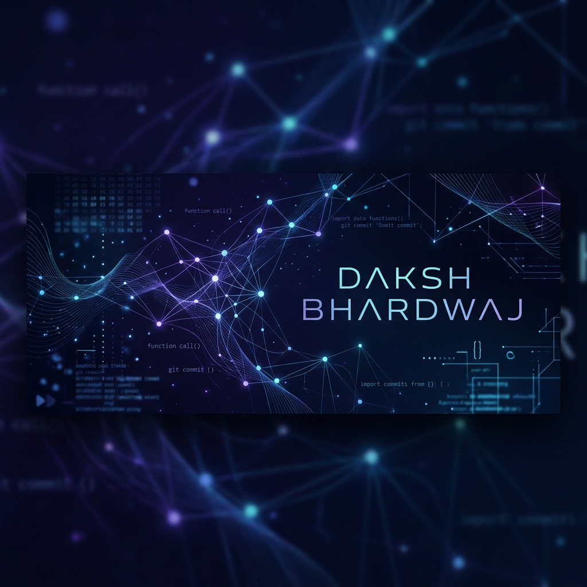

  

  

# 👋 Hi there, I'm Daksh Bhardwaj!

**Machine Learning Engineer & Full-Stack Developer** based in Pune, India.  
*Bridging the gap between intelligent algorithms and scalable user experiences.*

---

### 🎓 Education & Background

- 🎓 Pursuing B.Tech in **Computer Science (Artificial Intelligence)** at **Vishwakarma Institute of Technology, Pune** (Oct 2024 - Jun 2028 | CGPA: **9.06**)
- 💼 Former Project Intern at **Mimamsa Education Network** (engineered core ReactJS/Redux web platforms and optimized RESTful API endpoints handling 1,000+ daily requests)
- 🏆 **Hackathon Winner** at VIT Pune & finalist in 7 other national-level technical competitions
- 🗣️ **Public Speaker** & 3-time Model United Nations (MUN) winner across the Pune circuit

---

### 📊 GitHub Activity & Analytics

  

  

---

### 🛠️ Tech Stack & Skills

| Category | Technologies |
| :--- | :--- |
| **Languages** |      |
| **Machine Learning & AI** |   `Sentence Transformers` `spaCy` `Random Forest` `Time Series Analysis` |
| **Web & App Development** |       |
| **Databases** |    |
| **DevOps & Tools** |     |

---

### 📂 Featured Projects

<b>🔗 Campus Trust — Blockchain Verification Platform</b>

- **Tech Stack**: PyTeal (Algorand), Flask, Python.
- **Description**: Architected a decentralized, tamper-proof certificate verification system. Implementing role-based access for academic institutions, this system reduced verification times from days to under 10 seconds across 300+ credentials.

<b>🤖 SahAI — Your Placement Assistant</b>

- **Tech Stack**: Sentence Transformers, spaCy, Random Forest, Python.
- **Description**: Built an ML-driven interview assessment pipeline designed for automated semantic answer evaluation, speech scoring, and keyphrase detection. Reached ~87% scoring accuracy over 250+ candidate responses.

<b>🔍 ElectroLens — Hybrid AI Educational Platform</b>

- **Tech Stack**: MobileNetV2, Flutter, FastAPI, Gemini 1.5 Flash.
- **Description**: Real-time electronic component recognition platform. Engineered the model inference pipeline to achieve 90.4% accuracy across 14 categories with under 200ms latency, integrating gamified quizzes and leaderboards for student learning.

<b>📈 CAP MADE EASY — Perfect College Finder</b>

- **Tech Stack**: Random Forest, Reinforcement Learning, Python.
- **Description**: Built a recommendation engine trained on 10,000+ Maharashtra CAP round records, successfully delivering personalized college shortlists for over 400 students.

---

### 📬 Let's Connect!

- 💼 **LinkedIn**: [daksh-bhardwaj-40b533331](https://www.linkedin.com/in/daksh-bhardwaj-40b533331/)
- 📧 **Email**: [bhardwajdaksh1409@gmail.com](mailto:bhardwajdaksh1409@gmail.com)
- 🐙 **GitHub**: [@Dakshified](https://github.com/Dakshified)
